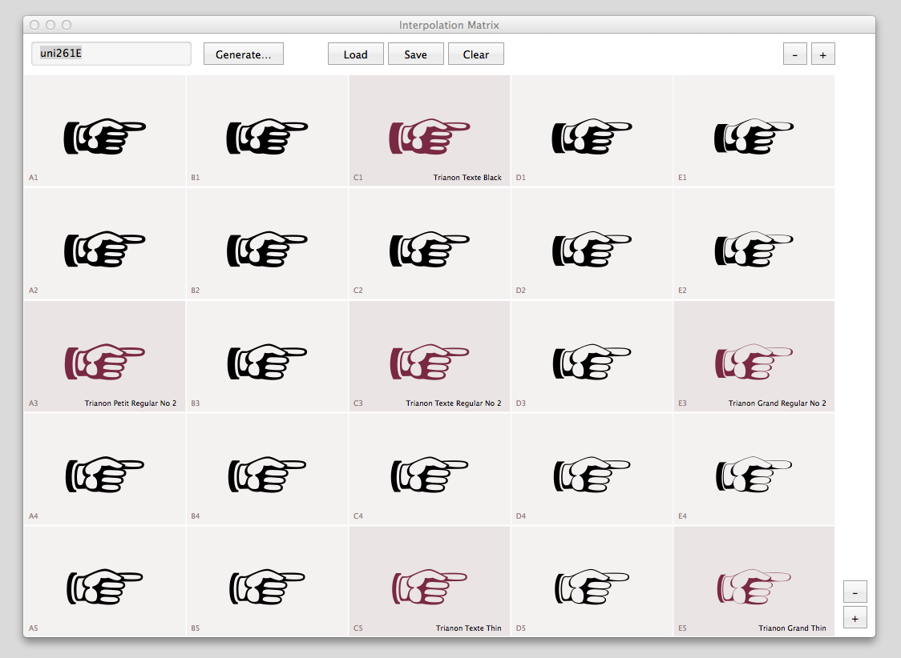
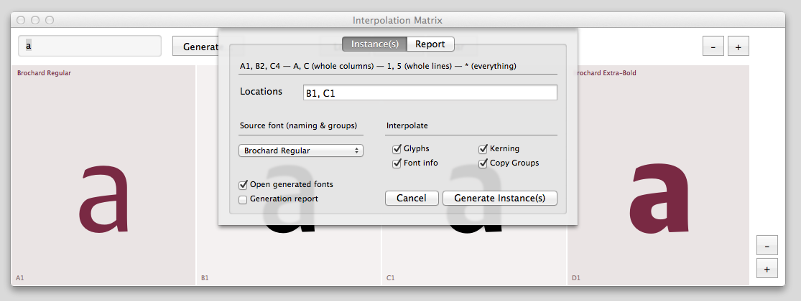
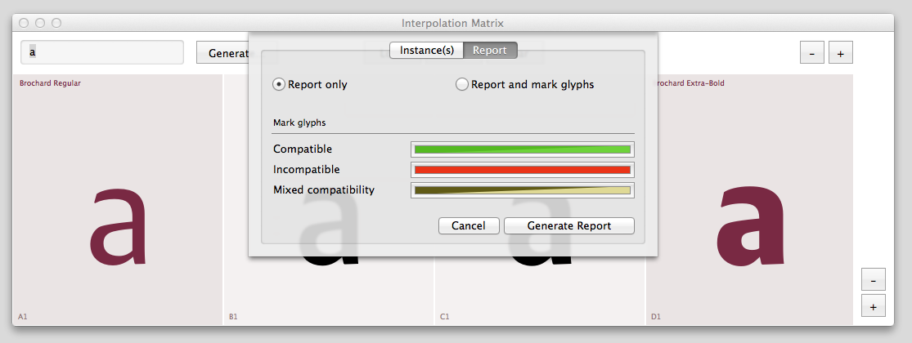

Interpolation Matrix (MutatorMath)
==================================

_This version of Interpolation Matrix is a fork of the original version by Loïc Sander._

The interpolation matrix is a tool requiring at least two master fonts open in RoboFont and interpolable glyphs (if the glyphs are incompatible, no instance will show). It allows you to preview interpolation and extrapolation based on master position in a grid.

This version of the script & the extension are a rewriting of the previous Interpolation Preview Matrix, now using LettError’s [MutatorMath](http://github.com/LettError/MutatorMath) ❤️ whereas previous inter/extrapolations were written by my simple self.

☞ [check out the demo on Vimeo](http://vimeo.com/109734720)

### Previewing interpolations

The glyphs are updated (almost) at draw time [mouseUp, keyUp], so you can modify glyphs and see changes happen in the matrix. Theoretically, you can have a 15×15 matrix of 225 fonts; beyond that, it would get too slow to use… Testing indicates that 7×7 is the ‘maximal-optimum’ use case.

### Generating instances

You can use the matrix to generate font instances or compatibility check reports. You choose which instance(s) to generate by naming their ‘coordinates’ (A1, B4, C3, etc.), or you can generate instances by whole rows/columns (A, 1, etc.), or all at once. Generated instances are issued in a folder next to the source master font (which you indicate before generating).

### Saving matrices

Last but not least, you can save matrices: grid size, window size and master fonts are stored and can be reaccessed quickly. The matrix stores a simple .txt file. It’s not ideal but does the trick for now.

